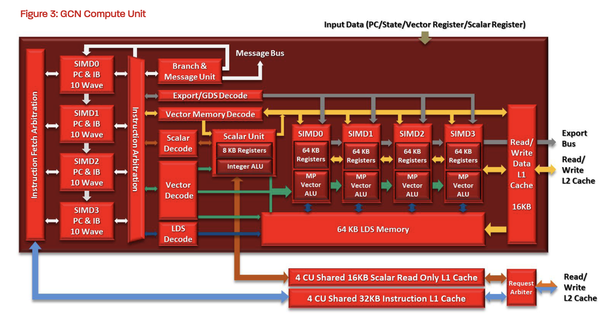
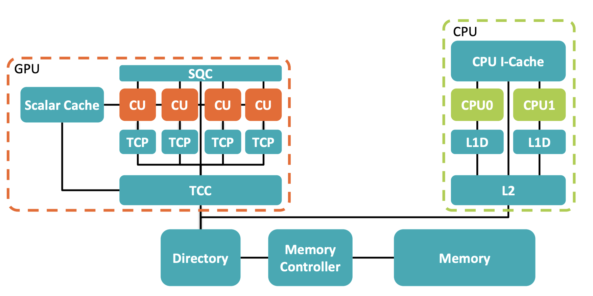
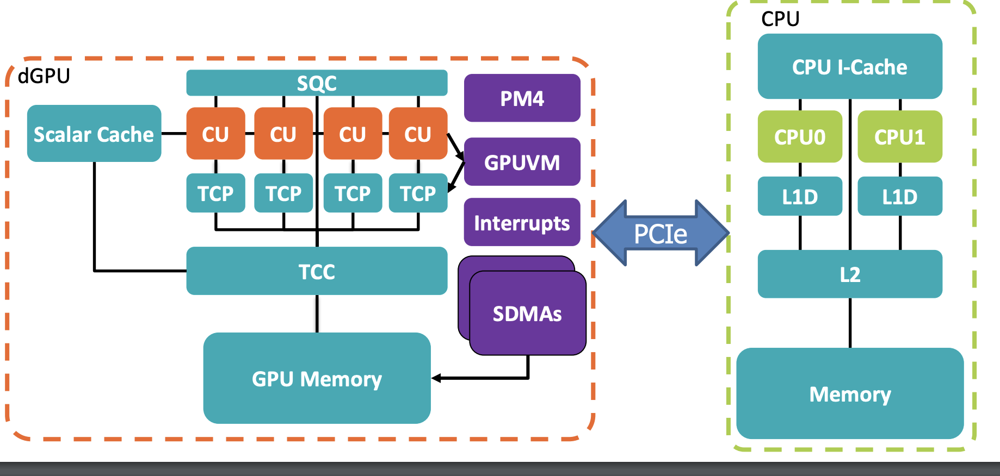

# Modeling GPU in GEM5


## Introduction

The GEM5 currently supports the modeling of AMD GPUs. The AMD GPU model in GEM5 is designed to simulate the architecture and behavior of AMD's Graphics Processing Units (GPUs) within the GEM5 framework. This model allows researchers and developers to study and analyze the performance of AMD GPUs in various computing scenarios, including general-purpose computing on GPUs (GPGPU) workloads.

At the heart of GCN is the Compute Unit (CU), which serves as the fundamental building block of the architecture. Each CU comprises of:

- 4 SIMD (Single Instruction, Multiple Data) units, each 16 lanes wide, capable of executing 64-thread wavefronts over four cycles.

- A scalar unit for handling operations that are uniform across all threads in a wavefront.

- A branch and message unit to manage control flow and communication.

- A 64KB Local Data Share (LDS), facilitating low-latency data sharing among threads within a CU.

- 16KB of L1 data cache and 64KB of vector register file per SIMD unit.


GCN introduced a coherent memory hierarchy, enabling better synchronization and data sharing across CUs. Some key features of the memory hierarchy include:

- L1 caches per CU for rapid data access.

- A shared L2 cache, ensuring coherency across multiple CUs.

Support for virtual memory and 64-bit addressing, facilitating seamless data access between CPU and GPU.

GCN employs a SIMT (Single Instruction, Multiple Threads) execution model, where each wavefront consists of 64 threads. The scalar unit executes instructions common to all threads, reducing redundancy, while the vector units handle divergent operations. This model improves efficiency in both graphics and compute workloads.




Image is taken from [AMD GCN Architecture](https://www.techpowerup.com/gpu-specs/docs/amd-gcn1-architecture.pdf)

### NVIDA - AMD terms 

| NVIDIA Term | AMD Term |
|-------------|----------|
| Streaming multiprocessor       | Compute unit       |
| Thread Processor ( Cuda core)          | Scalar or SIMD Unit   |
| Warp               | Wavefront         |


More on following link: [Terminology](https://people.eecs.ku.edu/~jrmiller/Courses/675/InClass/GPU/GPUTerminology.html)

## Using GEM5 to simulate AMD GPU

### Prerequisites

- Download and install the container image suitable for GPU simulation. The container includes:  
    - Libraries and tools for building the GEM5 GPU binary  
    - The [HIP compiler](https://github.com/ROCm/HIP) and other [ROCm](https://github.com/ROCm) tools necessary for compiling and running GPU applications  
    - All the dependencies and tools needed to compile your programs  

You can find the container image at the following link: [GEM5 GPU container](https://github.com/gem5/gem5/pkgs/container/gcn-gpu)

```shell
apptainer pull docker://ghcr.io/gem5/gcn-gpu:v24-0
```

- Build the GEM5 GPU binary using the container image.  (Apptainer is used to run the container image, and SCons is used to build the GEM5 binary.)

    ```shell
    GEM5_WORKSPACE=/home/ratkop/Documents/
    GEM5_ROOT=$GEM5_WORKSPACE/gem5
    GEM5_PATH=$GEM5_ROOT/build/VEGA_X86/
    APPTAINER_LOC=/home/ratkop/Documents/ratko_training/06-GPU
    APPTAINER_IMG=$APPTAINER_LOC/gcn-gpu_v24-0.sif


    cd $GEM5_ROOT
    apptainer exec $APPTAINER_IMG scons $GEM5_PATH/gem5.opt -j $(nproc) --mode=release
    ```

### Types of GPU simulation

GEM5 simulates GPUs using two different models, each corresponding to a different architectural integration and simulation mode:

- **APU (Accelerated Processing Unit)**:  
  In this model, the CPU and GPU share a single, unified address space, allowing both processors to access the same memory without explicit data transfers. This configuration is used in **system emulation mode**. The supported ISA is gfx902. 



- Sidenote: SQC = GPU L1 instruction cache, TCP = GPU L1 data cache, TCC = unified GPU L2 cache

Image is taken from [GEM5 GPU tutorial](https://github.com/gem5bootcamp/2024/blob/main/slides/04-GPU-model/gpu-slides.pdf)


- **dGPU (Discrete GPU)**:  
  In this model, the CPU and GPU maintain separate, distinct address spaces, reflecting a discrete GPU’s architecture. To support this separation, several additional hardware components are simulated, including:  
  - GPU Virtual Memory (GPUVM)  
  - DMA engines (SDMA)  
  - PM4 packet processor  
  - Host data bypass path  
  - Interrupt handler (highlighted in purple in architectural diagrams)  

  This configuration is used in **full system emulation mode**, enabling detailed simulation of memory transfers, control signaling, and hardware-level interactions between the CPU and GPU. It provides higher fidelity at the cost of increased simulation complexity and runtime. The supported ISA is gfx900. 



- Sidenote: SQC = GPU L1 instruction cache, TCP = GPU L1 data cache, TCC = unified GPU L2 cache

Image is taken from [GEM5 GPU tutorial](https://github.com/gem5bootcamp/2024/blob/main/slides/04-GPU-model/gpu-slides.pdf)


### Kernel execution

In the GPU simulation workflow, user-space software communicates with the GPU via `ioctl()` system calls.

> The ioctl() system call in Linux and Unix-like operating systems is a powerful and flexible mechanism used to perform device-specific input/output operations.


**ROCk (Radeon Open Compute Kernel driver)**:  
  - In **system emulation (SE) mode**, ROCK is **emulated** to handle `ioctl()` calls.  
  - In **full system (FS) mode**, ROCK is **simulated** as part of the full operating system stack.

At the hardware interface level, the **Command Processor (CP) frontend** manages command submission. It consists of two main components:

1. **HSA Packet Processor (HSAPP)**  
2. **Workgroup Dispatcher**

The interaction between the runtime and hardware proceeds as follows:

- The **runtime** creates **software HSA queues** in user space.
- The **HSAPP** maps these software queues to **hardware queues**.
- The **HSAPP** schedules active hardware queues for execution.
- The **runtime** creates and enqueues **AQL packets** (AMD Queue Language packets) into the queues.

Each AQL packet contains metadata and execution requirements for a kernel, including:  
- Kernel resource requirements  
- Kernel grid and workgroup size  
- Pointer to the kernel code object  
- And other necessary execution parameters

### GPU pipeline

The GPU follows a multi-stage pipeline to process work-items within wavefronts (WFs). The key pipeline stages are:  

1. **Fetch**  
   - Fetches instructions for dispatched wavefronts.  

2. **Scoreboard**  
   - Checks which wavefronts are ready to issue instructions based on dependencies.  


3. **Schedule**  
   - Selects a ready wavefront from the pool for execution.  


4. **Execute**  
   - Executes the selected wavefront on the available execution resources.  


5. **Memory Pipeline**  
   - Handles memory operations across different memory types:  
     - **Local Data Store (LDS)** operations
     - **Global memory** operations
     - **Scalar memory** operations

### Running GPU applications in GEM5

For the simulation of the GPU, we will use a pre-designed script called `apu_se.py`, located in the `configs/examples/` directory.

This script can be logically divided into **four main parts**:

1. **Parsing command-line arguments**  
   - Handles input parameters provided by the user when running the script.

2. **Configuration of the GPU system**  
   - Sets up the GPU components, including compute units, memory, and interconnects.

3. **Configuration of the CPU system**  
   - Defines the CPU cores, caches, and related components to work alongside the GPU.

4. **Building the overall system and running the simulation**  
   - Connects all components into a complete system and initiates the simulation process.

#### Parameters of the script

The script accepts several command-line arguments to customize the simulation. The most important parameters include:


| Parameter                | Type   | Default / Example  | Description                                                                                 |
|-------------------------|--------|-------------------|---------------------------------------------------------------------------------------------|
| `--dgpu`                 | bool   | False             | Enables dGPU mode (CPU and GPU have separate address spaces). Defaults to APU if not set.   |
| `--gfx-version`          | str    | "gfx902"          | Specifies GCN version (e.g., `gfx900`, `gfx902`).                                 |
| `--num-compute-units`    | int    |    4               | Number of Compute Units (CUs) in the GPU.                                                   |
| `--simds-per-cu`         | int    |       4            | Number of SIMD units per Compute Unit.                                                      |
| `--wf-size`              | int    |       64            | Size of each wavefront in number of work-items.                                             |
| `--wfs-per-simd`         | int    |         10          | Number of wavefronts slots per SIMD unit.                                                         |
| `--cu-per-sqc`           | int    |         4          | Number of CUs sharing a Scalar Queue Controller (SQC).                                       |
| `--cu-per-scalar-cache`  | int    |     4              | Number of CUs sharing a scalar cache.                                                       |                                                              |
| `--numLdsBanks`          | int    | 32                | Number of LDS banks.                                                                        |
| `--ldsBankConflictPenalty`| int   | 1                 | Cycles penalty per LDS bank conflict.                                                       |
| `--lds-size`             | int    | 65536             | LDS size in bytes.                                                                          |
| `--num-hw-queues`        | int    | 10                | Number of hardware queues in the packet processor.                                          |
| `--reg-alloc-policy`     | str    | "dynamic"         | Register allocation policy (`"simple"` or `"dynamic"`).                                     |
| `--m-type`               | int    | 5                 | Memory type (0–7) for GPU memory accesses; affects caching/sharing behavior.                |


