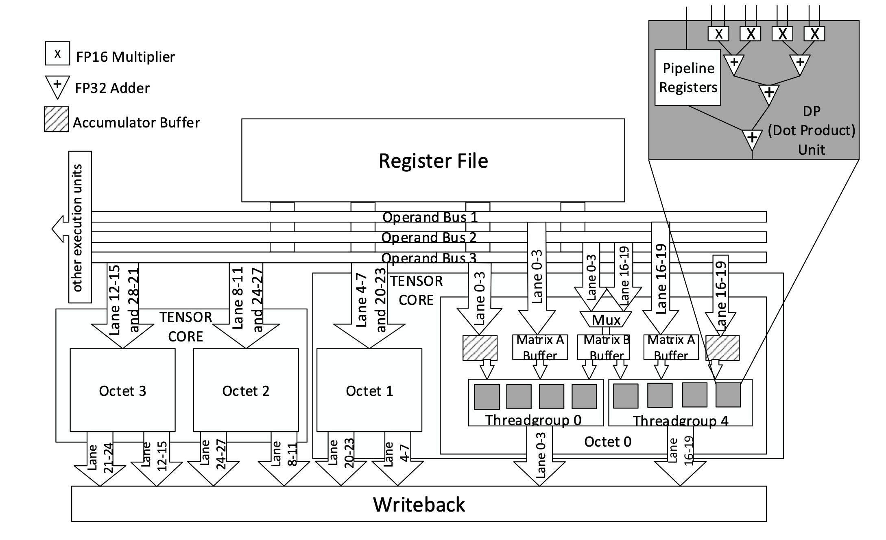

# Parallel Thread Execution for NVIDIA GPUs 

## Introduction 

NVIDIA PTX establishes a virtual machine and Instruction Set Architecture (ISA) tailored to execute general-purpose parallel threads. PTX programs undergo translation at installation to the specific hardware instruction set, facilitated by the PTX-to-GPU translator and driver, enabling NVIDIA GPUs to function as programmable parallel computing devices. This platform-independent assembly-like language abstracts complexities inherent in GPU hardware, allowing the developers to concentrate on optimizing algorithms and enhancing performance. Converting high-level code into PTX ensures compatibility across diverse NVIDIA GPU generations while leveraging advanced GPU fun

## PTX Machine model 

### A set of SIMT Multiprocessors 

The foundation of NVIDIA GPU architecture revolves around the scalable Streaming Multiprocessor (SMP). In CUDA code, threads are initially assigned to Streaming Multiprocessors. Each Streaming Multiprocessor is composed of Scalar Processor (SP) cores, a multithreaded instruction unit, and on-chip shared memory. Within the SMP, each thread is mapped to a scalar processor core, enabling independent execution with its own program counter and register state. The SMP orchestrates, schedules, and executes threads in groups known as warps. During instruction issuance, the SMP selects a ready-to-execute warp and issues the next instruction to its active threads. Warps execute a single common instruction at a time, achieving optimal efficiency when all warp threads align on their execution paths. If threads within a warp diverge due to data-dependent conditional branches, the warp sequentially executes each branch path, temporarily disabling non-participating threads. Upon completion, threads reconverge to a unified execution path. Notably, branch divergence occurs solely within a warp, while different warps execute autonomously, irrespective of their execution paths.

### Independent Thread Scheduling 

The GPU (starting from Volta) preserves the execution state per thread, encompassing essential elements such as a program counter and call stack, and can pause execution at an individual thread level. A scheduling optimizer schedules active threads within the same warp into execution units. This approach maintains the high throughput characteristic of SIMT execution in earlier NVIDIA GPUs while introducing enhanced flexibility: threads can now diverge and reconverge at a granularity finer than the warp level.

### On-chip Shared Memory 

Each multiprocessor is equipped with on-chip memory comprising four distinct types:

1. Local 32-bit registers per processor, providing dedicated storage for each scalar core's operations.
2. Shared memory accessible to all scalar cores within the multiprocessor, facilitating communication and data sharing among threads.
3. Read-only constant cache, shared among all scalar processor cores, and reserved for storing constant data accessible across threads within a read-only region.
4. Read-only texture cache, accessible to all scalar processor cores and managed by the texture unit, designated for storing and accessing texture data.

## Programming model 


<!--- WARP --->
The Parallel Thread Execution (PTX) programming model embodies explicit parallelism, enabling the specification of individual thread execution within a cooperative thread array (CTA). Within a CTA, comprising an array of threads executing a kernel concurrently or in parallel, synchronization points are strategically placed to ensure coordination among threads. Each thread within the CTA possesses a unique identifier, facilitating dynamic task assignment and data flow management. Thread identifiers, represented as a three-element vector, enable the allocation of tasks within one-dimensional, two-dimensional, or three-dimensional CTAs, catering to diverse parallel computing requirements.

A cluster refers to a collection of cooperative thread arrays (CTAs) that execute concurrently or in parallel and have the ability to synchronize and exchange information through shared memory. When communicating with another CTA via shared memory, the executing CTA must ensure that the shared memory of the target CTA exists before the communication.
Threads within distinct CTAs within the same cluster can synchronize and communicate through shared memory. Cluster-wide barriers serve as a mechanism to synchronize all threads within the cluster simultaneously. Each CTA within a cluster possesses a unique identifier, distinguishing it within its respective cluster.

<!--- https://users.elis.ugent.be/~leeckhou/papers/ipdps18.pdf --->

A CTA has a predefined maximum capacity for the number of threads it can accommodate, and likewise, there's a limit to the maximum number of CTAs a cluster can host. However, when clusters execute the same kernel, they can be grouped into a grid, allowing for a substantial increase in the total number of threads launched in a single kernel invocation. This batching of clusters into a grid expands the potential scale of parallelism. Nevertheless, this scalability enhancement is accompanied by a trade-off: thread communication and synchronization are diminished because threads in separate clusters are unable to communicate or synchronize with one another.

## State spaces, Types and Variables 

### State spaces 

State space denotes the storage with particular characteristics.

| Name  |  Description|
|---|---|
|.reg  | Registers  |
|.sreg |  Special registers, Read-only; Platform specific |
|.const   |  Shared, read-only memory |
|.global |  Global memory |
|.local  | Local memory, private to each thread  |
|.param  |  Kernel parameters |
|.shared  | Memory shared among threads in the cluster   |
|.tex | Global texture memory |


### Types  

The following table represents fundamental types in PTX:

| Basic Type  |  Fundamental Type specifier|
|---|---|
|Signed integer  | .s8, .s16, .s32, .s64  |
|Unsigned integer  | .u8, .u16, .u32, .u64  |
|Floating point | .f16, .f16x2, .f32, .f64  |
|Bits | .b8, .b16, .b32, .b64,   |

### Variables 

When defining data, you need to specify both space and type: 

```c
.global .u32 loc;
.reg    .s32 i;
.const  .f32 bias[] = {-1.0, 1.0};
.global .u8  bg[4] = {0, 0, 0, 0};
.reg    .v4 .f32 accel;
.reg    .pred p, q, r;
```

## Instructions operands 

PTX describes a load-store machine, so operands for ALU instructions must all be in variables declared in the ```.reg``` register state space. For most operations, the sizes of the operands must be consistent. 

Use ```ld``` operations to read operands, perform arithmetical operations, and finally use ```st``` operations to write to memory. To move values between registers, employ ```mov``` instructions, which copy data between registers.

### Addresses as operands

You can specify the address as: 

| Specifier  |  Explanation|
|---|---|
| [```var```]  | returns address of variable ```var```  |
| [```reg```]  | value of reg represents the address |
| [```reg + immOff```]  | a sum of ```immOff``` and value of ```reg``` represent  address of  |
| [```immAddr```]  | an immediate absolute address  |
| [```var[immOff]```]  | address of immOff-th element of array var |

Example: 

```c
.shared .u16 x;
.reg    .u16 r0;
.global .v4 .f32 V;
.reg    .v4 .f32 W;
.const  .s32 tbl[256];
.reg    .b32 p;
.reg    .s32 q;

ld.shared.u16   r0,[x];
ld.global.v4.f32 W, [V];
ld.const.s32    q, [tbl+12];
mov.u32         p, tbl;
```

## Mixed-precision computing with Tensor Cores  

Tensor Cores contribute to the performance of deep learning and AI workloads on NVIDIA GPUs by providing specialized hardware acceleration for certain types of calculations commonly used in AI algorithms, particularly neural networks. These cores are optimized for matrix multiplication and mixed-precision arithmetic, which are vital for the linear algebra operations underpinning deep learning models. The introduction of Tensor Cores in NVIDIA's Volta and Turing architectures allows for much higher throughput for these operations compared to using CUDA cores alone, enabling faster computation of the forward and backward passes during neural network training, as well as quicker inference when the trained models are deployed for actual use.

By allowing mixed-precision computing, Tensor Cores also enable more efficient use of memory and bandwidth while maintaining a balance between speed and accuracy. High-performance computing applications can greatly benefit from this because they can use lower-precision formats without significant loss of precision, thus speeding up computations and reducing power consumption (Markidis et al., 2018). Overall, Tensor Cores boost the performance and scalability of AI and deep learning workloads on NVIDIA GPUs.

### Tensor Core microarchitecture 

Architecturally, a Tensor Core provides a specialized form of computation that allows for the simultaneous execution of matrix multiply-and-accumulate operations. Each Tensor Core is capable of performing matrix multiply and add operations on 4x4 matrices. This capability dramatically increases the performance of calculations compared to traditional scalar or vector operations. The MMA operation is definied as follows: 

MMA(D,A,B,C) : D = AxB + C

According to [1], we can represent the microarchitecture of TensorCore with the following image: 



Each Tensor Core is structured into two sets of eight processing elements, known as octets, which carry out dot product operations on 2x4 tiles. These octets operate under the direction of distinct thread groups, each responsible for retrieving data from the register files and transferring it into dedicated matrix buffers. A thread group is made up of four sequential threads within the same warp. Dot products are computed concurrently across the various octets. At any given time, a maximum of four warps can be active on a single Streaming Multiprocessor, with each warp engaging two Tensor Cores simultaneously. One limitation to note is that operations performed by Tensor Cores cannot be issued in tandem with integer and floating-point instructions.

### Warp level Matrix Multiply and Accumulate (WMMA) API 

To employ operations on Tensor Cores at the PTX assembly level, NVIDIA introduced a set of three instructions in PTX version 6.0. All instructions employ a "sync" qualifier, which ensures that all threads within the warp reach a synchronization point before commencing the execution of the instruction. The PTX documentation uses the term "operand matrix" when referring to what is also known as a tile. Additionally, there is a "layout" qualifier within the instruction syntax, used to designate the storage format of an operand matrix in memory, deciding between row-major and column-major organization. The qualifier "shape" depicts the dimensions of the operand matrices, with notation such as m16n16k16 to signify a 16x16x16 fragment size. A "Type" qualifier is included to denote the precision level of the operand matrices, such as FP16 or FP32. With the Volta architecture, the matrices designated as A and B are required to be in FP16 format, whereas the C operand matrix is permitted to be either FP16 or FP32. Turing architecture, a later advancement from NVIDIA, introduces support for additional integer arithmetic modes more suited to inference tasks. For this architecture, the A and B operand matrices can be composed of 8, 4, or 1-bit integers, either signed or unsigned, while matrices C and D are stored in the more precise INT32 format to prevent the risk of overflow during the accumulation process.

#### WMMA load/store operations 

```
wmma.load.a.sync.layout.shape.type ra, [pa] {stride};
wmma.load.b.sync.layout.shape.type rb, [pb] {stride}; 
wmma.load.c.sync.layout.shape.type rc, [pc] {stride};
wmma.store.d.sync.layout.shape.type rd, [pd] {stride};
```

The operand matrices A, B, and C for matrix operations must be loaded into the register file. This operand loading uses three specific PTX instructions known as `wmma.load.` The respective instructions, `wmma.load.a`, `wmma.load.b`, and `wmma.load.c`, are tasked with loading the content of matrices A, B, and C into corresponding register general-purpose registers that are allocated among the threads of a warp. For ease of tile access within a larger matrix framework, both `wmma.load` and `wmma.store` instructions provide support for accessing memory with strides. The "stride" parameter is used to pinpoint the starting point of each row (or column) in memory. The following code illustrates the employment of WMMA load/store operations: 

```
wmma.load.c.sync.aligned.m16n16k16.global.row.f32 {x0, x1, x2, x3, x4, x5, x6, x7}, [rd1];
.....
wmma.store.d.sync.aligned.m16n16k16.global.row.f32 [rd0], {x0, x1, x2, x3, x4, x5, x6, x7};
```

#### WMMA Matrix multiply accumulate 

```
wmma.mma.sync.alayout.blayout.shape.dtype.ctype rd, ra, rb, rc;
```

The `wmma.mma` PTX instruction executes a warp-wide matrix multiplication and accumulation. This command calculates D=A×B+C by utilizing the registers a, b, and c, which hold matrices A, B, and C, respectively. The outcome of this computation is written into the general-purpose registers d within each thread. The following code illustrates the MMA operations using PTX assembly: 

```
    // row major
    wmma.load.a.sync.aligned.m16n16k16.global.row.f16 {a0, a1, a2, a3, a4, a5, a6, a7}, [rd1];
    // col major
    wmma.load.b.sync.aligned.m16n16k16.global.col.f16 {b0, b1, b2, b3, b4, b5, b6, b7}, [rd2];
    // row major
    wmma.load.c.sync.aligned.m16n16k16.global.row.f32 {c0, c1, c2, c3, c4, c5, c6, c7}, [rd3];
    // multiply
    wmma.mma.sync.aligned.m16n16k16.row.col.f32.f32 {d0, d1, d2, d3, d4, d5, d6, d7}, {a0, a1, a2, a3, a4, a5, a6, a7}, {b0, b1, b2, b3, b4, b5, b6, b7}, {c0, c1, c2, c3, c4, c5, c6, c7};
    // wmma store
    wmma.store.d.sync.aligned.m16n16k16.global.row.f32 [rd0], {d0, d1, d2, d3, d4, d5, d6, d7};\n\t
```

## Literature 

[1] Raihan, M.A., Goli, N. and Aamodt, T.M., 2019, March. Modeling deep learning accelerator enabled gpus. In 2019 IEEE International Symposium on Performance Analysis of Systems and Software (ISPASS) (pp. 79-92). IEEE.

[2] NVIDIA PTX, Warp Level Matrix Multiply-Accumulate Instructions https://docs.nvidia.com/cuda/parallel-thread-execution/index.html#warp-level-matrix-multiply-accumulate-instructions